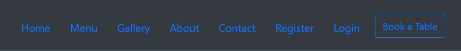
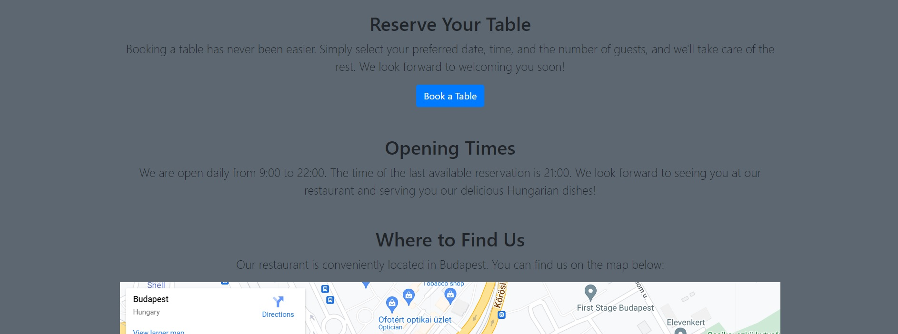

# CODE INSTITUTE PROJECT 4 - Budapest Gourmet

## Overview

My chosen project was to create a website for a small restaurant. This is a fully functional website including all the basic features a small restaurant business would need, however the project has lot of scope for additional features.
The website includes a section only available to registered user, this is where bookings can be created, viewed, edited or deleted.

User credentials to access this section are:

- Admin user:

Username: admin
Password: Beechfern22

- Registered user:

Username: istvanbiczyk
Password: tablebooking2


The deployed website can be found here : <a href = "https://table-booking-system-sb.herokuapp.com/">Budapest Gourmet</a>

#  
## Table of Contents

1. [UX](#ux)
    - [Project Goals](#project-goals)
    - [User Stories](#user-stories)
    - [Design](#design)

2. [Features](#features)
    - [Existing Features](#existing-features)
        - [Landing Page](#landing-page)
        - [Menu Page](#product-page)
        - [About Page](#about-page)
        - [Contact Page](#contact-page)
        - [Register Page](#register-page)
        - [Login Page](#login-page)
        - [Booking Page](#login-page)
        - [Admin/ Staff Management](#admin-staff-managment)
        - [Django allauth authentication](#django-allauth-authentication)
    - [Features Left to Implement](#features-left-to-implement)
    - [Defensive Design](#defensive-design)

3. [Information Architecture](#information-architecture)
    - [Database Choice](#database-choice)
    - [Data Modeling](#data-modeling)

4. [Technologies Used](#technologies-used)
    - [Languages](#languages)
    - [Libraries and Packages](#libraries-and-packages)
    - [Tools](#tools)
    - [Databases](#databases)

5. [Deployment](#deployment)

6. [Testing](#testing)

7. [Credits](#credits)

8. [Disclaimer](#disclaimer)


# UX
## Project Goals
### Target Audience
- People who are looking for authentic Hungarian dining experience.
- People who are looking for a unique venue for a birthday party.
- People who seek experiences such as wine tasting.

### Visitor / User Goals
- Find information about the restaurant such as its location, hours of operation, and contact information.
- View the menu and see pictures, prices and possibly ingredients.
- Make a reservation in a simple and user-friendly way. See the availability of tables at certain times.
- Read reviews or testimonials from previous visitors.
- Plan a private event based on the information on the options, pricing, and process to book the venue.

### Business Goals (Site Owner's Goals)
- Increase online table reservations
- Improve Brand Awareness
- Promote Specials and Events
- Expand Customer Base

<div><a href="#table-of-contents">Back to top</a></div>

## User Stories

- Viewing and Navigation

- As Site User I want to see the restaurant's operating hours, menu, and contact information, so I can make an informed decision before booking a table.

| AS A/AN     | I WANT TO BE ABLE TO ... | SO THAT I CAN... |
| ----------- | ----------- | ----------- |
| Site User | access the website on any device | Use the website anytime and anywhere |
| Site User | Easily see what services are offered | Find the service I want to use |  
| Site User | All the important services are accesible from nav bar| Don't need to scroll to find important information |
| Site User | Have a Book now icon on the nav bar | Quickly and easily make a booking |

<br/>

- Registration and User Accounts

| AS A/AN     | I WANT TO BE ABLE TO ... | SO THAT I CAN... |
| ----------- | ----------- | ----------- |
| Site User | Easily and quickly sign up/ sign in | Access the registered user features |
| Site User | Save user information |  Log in quicker next time |
| Site User | Secure my information with a password | Other users can't access my account |
| Site User | Reset forgotten login information | Recover access to my account |


<br/>

- Making a booking

| AS A/AN     | I WANT TO BE ABLE TO ... | SO THAT I CAN... |
| ----------- | ----------- | ----------- |
| Site User | Select a time and date for my booking | The table is available when I arrive |
| Site User | Specify the number of guests | The staff can prepare |
| Site User | Add special requests/ notes to my booking | The staff can prepare |
| Site User | Receive a comfirmation of my booking | I know the booking is made |
| Site User | Modifiy or cancel my booking | Make changes when necessary |
| Site User | View other bookings | Know when the reataurant is busy or quiet |
| Site User | Leave feedback and ratings | Staff can improve service and potential customers can make informed decisions |
| Site Admin/ Staff | View and manage all bookings | Know when the restaurant is busy or quiet |
| Site Admin/ Staff | View customer details | Provide a personalised service |
| Site Admin/ Staff | Monitor table avaliability | Accomodate customers without a booking |
| Site Admin/ Staff | Receive notifications of new/amended bookings | Monitor changes without constantly checking for new bookings |

<br/>


<div><a href="#table-of-contents">Back to top</a></div>

## Design

### Wireframes

Wireframes were created with...
You can find the wireframes...

### Brand Identity

- Vision: To be recognised as a great destination for authentic Hungarian cuisine.
- Mission: To deliver an outstanding dining experience by serving high-quality, traditional Hungarian dishes made from the finest local ingredients, and by providing exceptional service in a warm and welcoming environment.
- Values: Authenticity: Staying true to the traditional recipes. Hospitality: Creating a warm, welcoming environment. Sustainability: Use local suppliers wherever possible.

### Color Scheme

I chose range of grays, whites, blues, and a touch of warm orange to create a comforting and inviting ambiance.
- The background color of the website is a soft dark gray: #5C6771
- The navigation bar's background color is a medium-gray: #808080
- The navigation links themselves are a vibrant blue: #007bff
- The brand and hero text is white (#fff) and its hover effect uses warm orange color:#D4672C
- Different colors to indicate various types of messages: blue (#2196F3) for informational messages, green (#4CAF50) for success messages, orange (#FF9800) for warning messages, and red (#F44336) for error messages.

### Typography

- Fonts: Merienda, Roboto and Playfair Display.
- Icons: [Bootstrap Icons](https://icons.getbootstrap.com/) were used accross the site.
- Favicon: The favicon was sourced from [www.flaticon.com](https://www.flaticon.com/).


# Features

## Existing Features
This website is composed of a single application: 

## Landing Page
The Landing Page is designed as a single page website 

### Navbar

The Navbar is fixed at the top of pages across the site to help with navigating the site. The navbar contains: 
- Brand Logo, Site Menu, Account Menu and Book a Table button. The menu collapses to toggle icon less than 992px width.


Navbar for larger screensizes (width > 992px)



Navbar for smaller screensizes (width < 992px)


Navbar for logged in users


### Hero Image and Hero Text

The next feature of the Landing Page is the Hero Image and Hero Text. The image is a full width picture of the restaurant interior and the Hero Text is located at the center of it. It's white text with an orange hover effect.

### Why Choose Us?

A list of main selling points for the restaurant, laid out in a horizontal line.


### Featured Dish

A picture and the description of the current signature dish, side by side.


### Events & News

Pictures and description of any regular events and news about the restaurant.


### Footer
The footer section contains the Social Media icons.I included icons for Twitter, Facebook, Instagram and Pinterest. Currently they take the user back to the homepage but on the deployed website of the actual business they would take the user to the relevant social media pages.


<div><a href="#table-of-contents">Back to top</a></div>

## Menu Page

 Contains the restaurant menu in 3 vertical tables, one for the Starters, Main Courses amd Desserts each.


## Gallery Page

Contains images of three selected dishes in each of the categories included in the menu.Next to each image there is a card containing the name, a short description and the price of each dish. The images and description cards are arranged in a horizontal, responsive row.


## About Page

Divided into the following sections:

- About Us: A brief description of the business and its mission.

- Welcome message, also includes an image of the restaurant's interior.


- Reserve your table: A brief description of the reservation process and a button taking the customer to the Login or Booking page. 

- Opening Times: 

- Where to find Us: An embedded section of Google Maps showing the supposed location of the restaurant. This section would also contain the address, phone number, email address and other details of the restaurant but this is a fictional business, invented for the purpose of the project.



## Contact Page

Contains the contact form of the restaurant. The form has fields for the Name, Email, Subject and Message as well as the Submit and Clear Form Buttons.
The form was styled using Bootstrap and Django Crispy Forms. This is the case with all other forms found on the website.


## Register Page

Contains the Sign Up form. The form has 6 fields in the following vertical order. 1 - Username, 2 - Email, 3 - First Name, 4 - Last Name, 5 - Password, 6 - Password (again). This and all other user forms (except for the Booking form) are imported with the Django Allauth package and modified to better fit the needs of the site.
There are also two buttons, one for signing in for existing users and a submit button for signing up.


## Login Page

This page contains the Sign In form, again styled using Crispy Forms. It contains two fields, one for the Username and another for the Password. This page also includes a Sign In button for submitting the data and a Sign Up button redirecting the visitor to the Register page. Upon signing in the user is redirected to the Index page.


## Booking Pages

These pages are only accessible to registered users and only after logging in first.

Login credentials can be found in the Overview section of the Readme but are also included here:

- Admin user:

Username: admin
Password: Beechfern22

- Registered user:

Username: istvanbiczyk
Password: tablebooking2


- The page can be acessed by clicking the Book a Table button, located in the Navbar. Another similar button can found o the About page. For the purpose of the project only registered site users can make a booking after signing in.The table contains the Booking form. This is a bespoke form created for the purpose of the project.
It has fields for selecting the date and time of the booking, the number of guests and one of the 5 tables. Custom data validation is included for every input field.
The booking processs and associated views are protected by the `@login_required` decorator to stop users from accessing these pages without logging in, by typing in the relevant URL-s. If a site visitor attempts to do this they are the redirected to the Login page.


- The user can not make a booking for the past or for a time outside the opening hours. The number of guests can't be less than 1 or greater than 25 which is considered to be the full capacity of the restaurant. Bookings can be made for 30 minute intervals and it's not possible to make two bookings for the same table at the same time.
Special requests can be used to warn about allergies and dietary or any other needs.
There is a button beneath the form for submitting the information. Entering invalid data results in warning messages appearing and pointing out the error to the user and prompting them to correct the relevant details. Upon entering and submitting valid data the user is redirected to the Booking Confirmation page where they can check if they entered the correct details.


From here it's possible to access the booking list, which is also accessible from the booking form page. The bookings list has different views depending on whether the user is a customer or a member of staff (Admin user). The customer can view all the bookings (except for the name of the other customers) but only edit or delete bookings made by themselves. The Admin user can access, edit and delete all the bookings contained within the list.


Next to each booking in the list there are two buttons, one for editing and one for deleting the relevant booking. These buttons are a requirement for the CRUD functionality which is understandably an essential requirement for the project. The unauthorised user clicking either of these buttons triggers a warning message informing them that they don't have a permission for these actions. However they are free to edit or delete any bookings made by themselves.
Clicking the Edit button takes the user to the Update Booking page. This page is page is almost identical to the Booking page except for the text making it clear that the user is updating a previous booking rather than making a new one. The contained form also looks identical to the original Booking Form. Upon amending the original booking details shown in the form and clicking the Update Booking button the user is taken back to the Booking Confirmation page.


The other option available to the user on the Bookings List page is to delete one of their bookings. Upon clicking the red Delete button the user is taken to the Delete Reservation page. Here they are given another prompt to confirm that they wish to delete the selected booking or want to return to the Bookings List page. Deleting the selected booking also results in the user being redirected to the Bookings List, which will no longer include the deleted booking.


The Bookings List page looks slightly different when viewed by the Admin User. They can see the names and details of all the customers on the list and edit or delete any booking. This is necessary so that they can make changes if asked by the customers via other ways such as a phone call or in person.


## Admin/ Staff Management

The database contains the option of adding further staff members but this featureisn't yet fully implemented. Currently Staff members can only be added throught the Django Admin dashboard.

## Django-allauth user authentication

The django-allauth package is used to handle user authentication. This also includes form validation with customised error and success messages. Error messages are highlighted in red and success messages are highlighted in green. Currently the following pages are used in the application:

- Sign Up: This form normally asks the users to fill out the following fields to create an account: `E-mail`, `User Name` and `Password`. However I added two more fields for the user's `First Name`and `Last Name`. The name is used to provide a more personalised user experience throughout the booking handling process.


- Log In: Users will be asked to input `User Name` and `Password` to login. If the user is successfully logged in they are redirected to the landing page. Only logged in users are able to access the booking form and associated features.


- Log out: The Log out page is accessible from the site menu. The user is prompted to confirm their intention to sign out. After successfully signing out the user is redirected to the landing page. A success message is also shown on the Bookings List page.


<div><a href="#table-of-contents">Back to top</a></div>

## Features Left to Implement

There are some of features left to implement in the future which I could not add to the project this time due to time constraints. These features can be added later for a more complete user experience.

### 1.
The ability for the Admin user to add further users with Staff priviliges which would give them similar level of access to the booking process as the Admin user but without access to the Django Admin dashboard.

### 2. 
The option for the user to reset a forgotten password. Currently this is not possible and the user has to register a new account.

### 3. 
The option for the user to leave feedback and reviews. This should be restricted to registered user, ideally after completing a booking.

### 4.
The ability to offer a takeaway service and take online payments. However, this service can also be provided by a third party.

### 5.
A blog could also be implemented on the website to further promote the restaurant and the services offered.

## Defensive Design

### Error messages
- A mixture of built in and custom error messages are used throughout the booking process.

### Form Validation
- Django Form Validation is included with the forms contained within the django-allauth package

### Booking Form Validation
- Custom form validation is added that stops the user from making a booking that's in the past or outside opening hours. There is also validation for guest numbers to stop the user from selecting a number less than 1 or greater than 25 which is the capacity of the restaurant.

# Information Architecture

## Database choice
- SQLite3 for development.

- [ElephantSQL](https://www.elephantsql.com/) database used for development and deployment.

## Data Modeling


### Table Booking App


# Technologies Used
The main frontend development was created using HTML, CSS, JavaScript and their libraries. The main backend development was powered by Python and Django.

## Languages
- HTML, CSS, JavaScript, Python

## Frameworks
- [Django](https://www.djangoproject.com/) - Version 3.2.16 - A high-level Python web framework.

- [Bootstrap](https://getbootstrap.com/docs/4.5/getting-started/introduction/) - Version 4.5.2 - A framework for building responsive, mobile-first sites.

## Libraries and Packages
- [Django](https://www.djangoproject.com/)
- [Django Crispy Forms](https://django-crispy-forms.readthedocs.io/en/latest/)
- [Django Allauth](https://django-allauth.readthedocs.io/en/latest/installation.html)
- [jQuery](https://jquery.com/) - Version 3.5.1 - A JavaScript Framework
- [psycopg2](https://pypi.org/project/psycopg2/) - A PostgreSQL database adapter for Python
- [gunicorn](https://pypi.org/project/gunicorn/) - a Python WSGI HTTP Server
- [Bootstrap (v4.5.1)](https://www.bootstrapcdn.com/)
- [JQuery](https://jquery.com/)
- [Font Awesome](https://fontawesome.com/)
- [Google Fonts](https://fonts.google.com/)

## Tools
- [Git](https://git-scm.com/) - For version control.
- [GitHub](https://github.com/) - To save and store the files for this project.
- [Gitpod](https://www.gitpod.io/) - Online code editor.
- [PIP](https://pip.pypa.io/en/stable/installing/)

## Databases
- [PostgreSQL](https://www.postgresql.org/) - database used for development.
- [ElephantSQL](https://www.elephantsql.com)- database used for deployment.


<div><a href="#table-of-contents">Back to top</a></div>

# Development and Deployment

## Deployment 
The project is deployed using Heroku. The steps required to deploy the project are described below:

#### Creating the Live Database

- SQLite 3 is used for development but for deployment a new external database which can be accessed by Heroku.

1. Go to the [ElephantSQL](https://www.elephantsql.com/) dashboard and click the create new instance button on the top right.
2. Name the plan (your project name is a good choice), select tiny turtle plan (this is the free plan) and choose the region that is closest to you then click the review button.
3. Check the details are all correct and then click create instance on the bottom right.
4. Go to the dashboard and select the database just created.
5. Copy the URL (you can click the clipboard icon to copy)

### Heroku App Setup

  1. From the [Heroku dashboard](https://dashboard.heroku.com/), click the new button in the top right corner and select create new app.
  2. Give your app a name (this must be unique), select the region that is closest to you and then click the create app button bottom left.
  3. Open the settings tab and create a new config var of `DATABASE_URL` and paste the database URL you copied from elephantSQL into the value (the value should not have quotation marks around it).

### Gitpod Setup

1. Install dj_database_url and psycopg2 (they are both needed for connecting to the external database you've just set up):

   ```bash
   pip3 install dj_database_url==0.5.0 psycopg2
   ```

2. Update your requirements.txt file with the packages just installed:

    ```bash
    pip3 freeze > requirements.txt
    ```

3. In settings.py underneath import os, add `import dj_database_url`

4. Find the section for DATABASES and comment out the code. Add the following code below the commented out database block, and use the URL copied from elephantSQL for the value:

    (NOTE! don't delete the original section, as this is a temporary step whilst we connect the external database. Make sure you don't push this value to GitHub - this value should not be saved to GitHub, it will be added to the Heroku config vars in a later step, this is temporary to allow us to migrate our models to the external database)

    ```python
    DATABASES = {
        'default': dj_database_url.parse('paste-elephantsql-db-url-here')
    }
    ```

5. In the terminal, run the show migrations command to confirm connection to the external database:

    ```bash
    python3 manage.py runserver
    ```

6. If you have connected the database correctly you will see a list of migrations that are unchecked. You can now run migrations to migrate the models to the new database:

    ```bash
    python3 manage.py migrate
    ```

7. Create a superuser for the new database. Input a username, email and password when directed.

    ```bash
    python3 manage.py createsuperuser
    ```

8. You should now be able to go to the browser tab on the left of the page in elephantsql, click the table queries button and see the user you've just created by selecting the auth_user table.
9. We can now add an if/else statement for the databases in settings.py, so we use the development database while in development (the code we commented out) - and the external database on the live site (note the change where the db URL was is now a variable we will use in Heroku):

    ```python
    if 'DATABASE_URL' in os.environ:
        DATABASES = {
          'default': dj_database_url.parse(os.environ.get('DATABASE_URL'))
        }
    else:
        DATABASES = {
            'default': {
                'ENGINE': 'django.db.backends.sqlite3',
                'NAME': os.path.join(BASE_DIR, 'db.sqlite3')
          }
        }
    ```

10. Install gunicorn which will act as our webserver and freeze this to the requirements.txt file:

    ```bash
    pip3 install gunicorn
    pip3 freeze > requirements.txt
    ```

11. Create a `Procfile` in the root directory. This tells Heroku to create a web dyno which runs gunicorn and serves our django app. Add the following to the file (making sure not to leave any blank lines underneath):

    ```Procfile
    web: gunicorn seaside_sewing.wsgi:application
    ```

12. Log into the Heroku CLI in the terminal and then run the following command to disable collectstatic. This command tells Heroku not to collect static files when we deploy:

    ```bash
    heroku config:set DISABLE_COLLECTSTATIC=1 --app heroku-app-name-here
    ```

13. We will also need to add the Heroku app and localhost (which will allow GitPod to still work) to ALLOWED_HOSTS = [] in settings.py:

    ```python
    ALLOWED_HOSTS = ['{heroku deployed site URL here}', 'localhost' ]
    ```

14. Save, add, commit and push the changes to GitHub. You can then also initialize the Heroku git remote in the terminal and push to Heroku with:

    ```bash
    heroku git:remote -a {app name here}
    git push heroku master
    ```

15. You should now be able to see the deployed site (without any static files as we haven't set these up yet).

16. To enable automatic deploys on Heroku, go to the deploy tab and click the connect to GitHub button in the deployment method section. Search for the projects repository and then click connect. Click `Enable Automatic Deploys` at the bottom of the page.

#### Generating a SECRET KEY and setting Debug

1. Django automatically sets a secret key when you create your project, however we shouldn't use this default key in our deployed version, as it leaves our site vulnerable. We can use a random key generator to create a new SECRET_KEY which we can then add to our Heroku config vars which will then keep the key protected.
2. [Django Secret Key Generator](https://miniwebtool.com/django-secret-key-generator/) is an example of a site we could use to create our secret key. Create a new key and copy the value.
3. In Heroku settings create a new config var with a key of `SECRET_KEY`. The value will be the secret key we just created. Click add.
4. In settings.py we can now update the `SECRET_KEY` variable, asking it to get the secret key from the environment, or use an empty string in development:

    ```python
    SECRET_KEY = os.environ.get('SECRET_KEY', ' ')
    ```

5. We can now adjust the `DEBUG` variable to only set DEBUG as true if in development:

    ```python
    DEBUG = 'DEVELOPMENT' in os.environ
    ```

6. Save, add, commit and push these changes.

#### Connecting to Cloudinary

- [Cloudinary](https://cloudinary.com/) is used for storing static files and images.

1. In settings.py add the following lines to INSTALLED APPS: 'cloudinary_storage', 'cloudinary',
2. Then add the following lines: STATIC_URL = '/static/'
STATICFILES_STORAGE = 'cloudinary_storage.storage.StaticHashedCloudinaryStorage'
STATICFILES_DIRS = [os.path.join(BASE_DIR, 'static')]
STATIC_ROOT = os.path.join(BASE_DIR, 'staticfiles')

MEDIA_URL = '/media/'
DEFAULT_FILE_STORAGE = 'cloudinary_storage.storage.MediaCloudinaryStorage'

3. In env.py add the following line: os.environ["CLOUDINARY_URL"] = "your_cloudinary_URL"

4. Add the Cloudinary URL to the Heroku Config Vars.

## Testing

The W3C Markup Validator and W3C CSS Validator Services were used to validate every page of the project to ensure there were no syntax errors in the project.

-   [W3C Markup Validator](https://validator.w3.org/) 
-   [W3C CSS Validator](https://jigsaw.w3.org/css-validator/) 

These were used to validate the code via direkt input. The code passed without errors

Lighthouse was also used to validate the project for performance, accessability, best practices and SEO.

-   [Lighthouse](https://developers.google.com/web/tools/lighthouse) 


### Further Testing

-   Tested all features on the application to ensure that functionality is fully working.
-   Tested on Google Chrome and Microsoft Edge.
-   Viewed on laptop, tablet and mobile device..
-   Tested all links, buttons and inputs extensively.

### Known Bugs

- There are multiple user messages displayed when first accessing the Bookings List, depending on previous user actions. The messages disappear once the page is refreshed.
- The images displayed in the Gallery shrink too small when viewed on certain screen sizes.

## Credits

### Content & Code
- [Django](https://docs.djangoproject.com/en/dev/releases/3.2/), [Bootstrap 4](https://getbootstrap.com/docs/4.0/getting-started/introduction/) documentation and [Stack Overflow](https://stackoverflow.com/questions) was used throughout the project.
Small sections of code were adapted and used. All textual content was written by me.

### Images & Media
- Copyright free stock images were used.

### Acknowledgements
- Thanks to: my Code Institute Mentor, Dick Vlaanderen for his guidance and advice.
- The Tutors for their help.
- The Code Institute Slack community.

### Disclaimer
This website is created for educational purposes only.